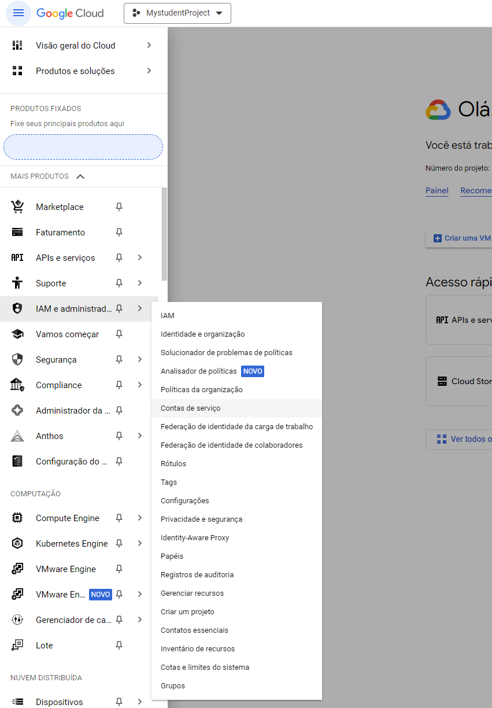
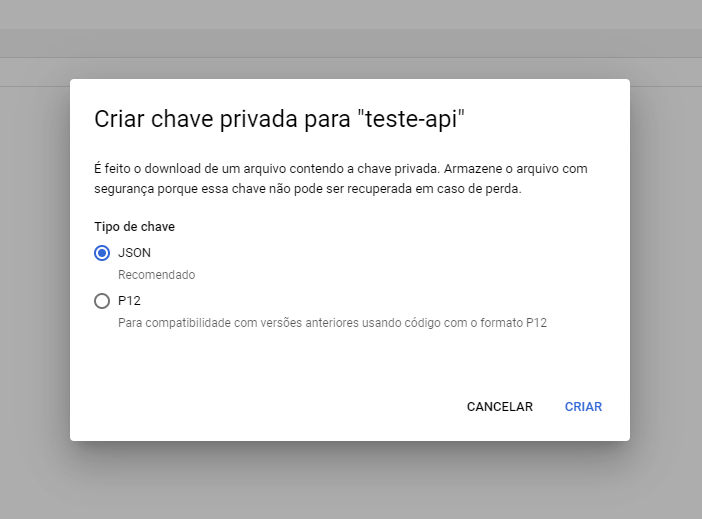
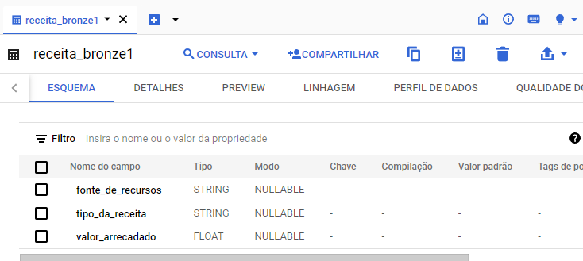
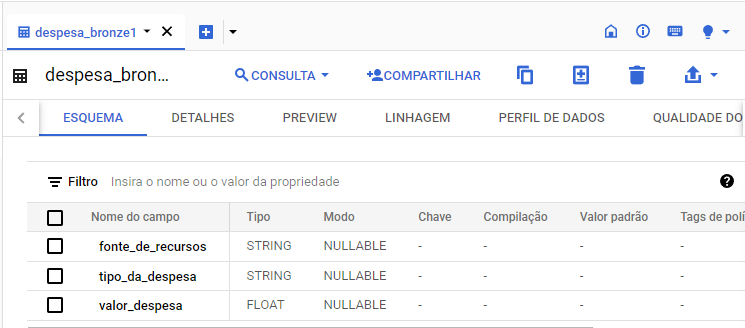
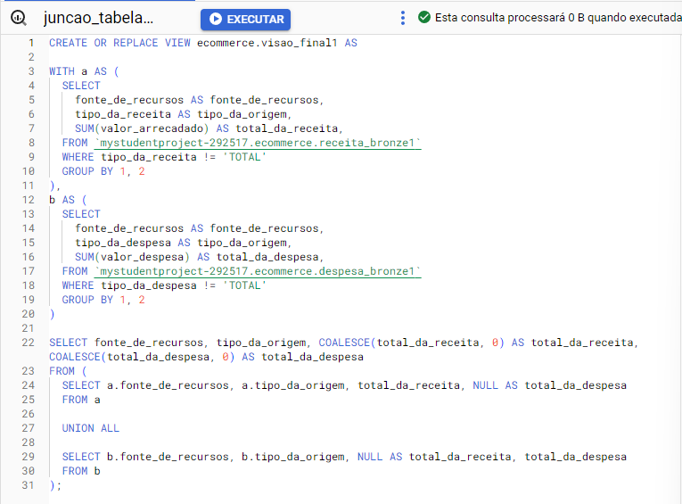
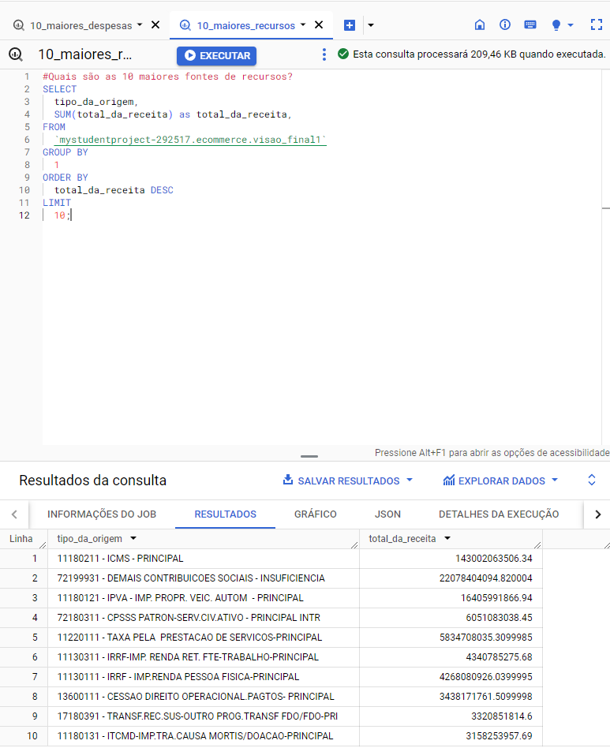
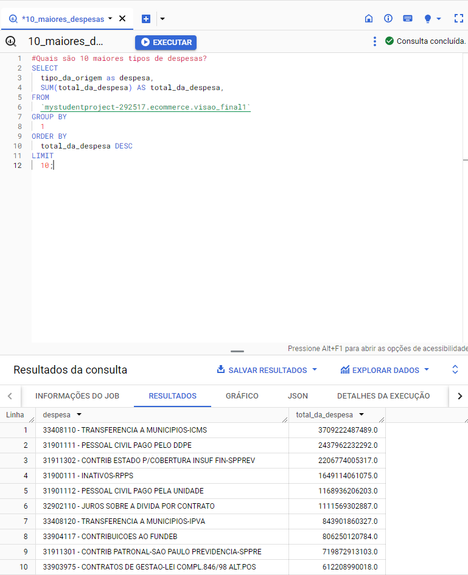

## Teste de engenharia de dados.

### O teste consiste em desenvolver um processo de ETL para processar arquivos CSV e armazenar os dados em um banco de dados.

### Arquivos para o teste:
- [gdvReceitasExcel.csv](docs/gdvReceitasExcel.csv)
- [gdvDespesasExcel.csv](docs/gdvReceitasExcel.csv)

### Requisitos:

- Adequar os tipos de dados para os mais apropriados.
- Utilizar Python e/ou SQL para a análise dos dados.
- Hospedar o código do projeto e uma explicação detalhada no GitHub.

### Ferramentas utilizadas: 

- Para leitura e tratamento dos arquivos: Python
- Banco de dados para armazenar: BigQuery
- Para analise dos dados: SQL
- Hospedagem do código: GitHub

### Entregáveis:

- Criar uma tabela final, sendo a junção das outras duas tabelas que deve conter a soma do valor total de receita, e o total da despesa do Estado de São Paulo, agrupado pela fonte de recursos e tipo de despesa.
- Responder quais são as 10 maiores fontes de recursos e os 10 maiores tipos de despesa.

## Criando o arquivo de conexão json no BigQuery:

### No menu de navegação -> IAM e administrador -> Contas de serviço -> Criar uma nova conta de serviço -> Clicar nos 3 pontos a direita, assim que a conta for criada -> Gerenciar Chaves -> Adicionar CHAVE -> Criar uma nova chave.

### Imagens de exemplo:

### Acessando Contas de serviço:

### Criando chave json e realizando o download:

### Segunda etapa, scripts para tratar os dados nos arquivos csv e realizar o envio para ao BigQuery: 
- [Script Python](scripts/teste_esfera.ipynb)

#### Obs: o script possui comentários para o melhor entendimento do código.

## Unificando os dados no BigQuery: 

### Esquema das tabelas: 

#### Tabela receita:

#### Tabela despesa:

### Query que junta as duas tabelas e cria uma view: 

### Respondendo as duas questões 

## Quais são os 10 maiores recursos? 

## Quais são as 10 maiores despesas? 

### Teste finalizado.
